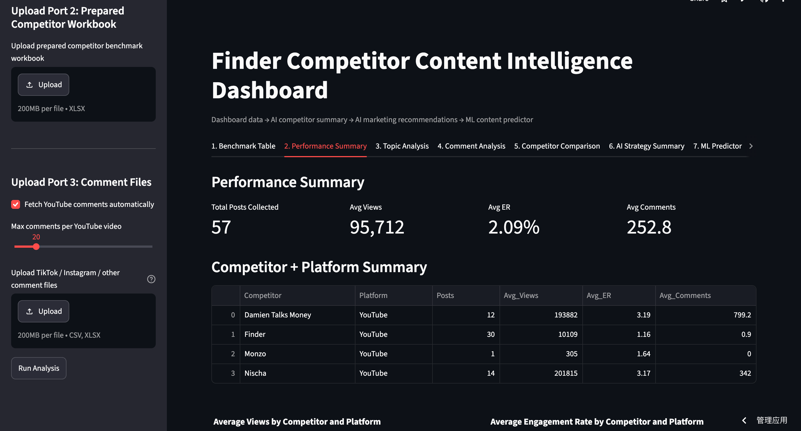
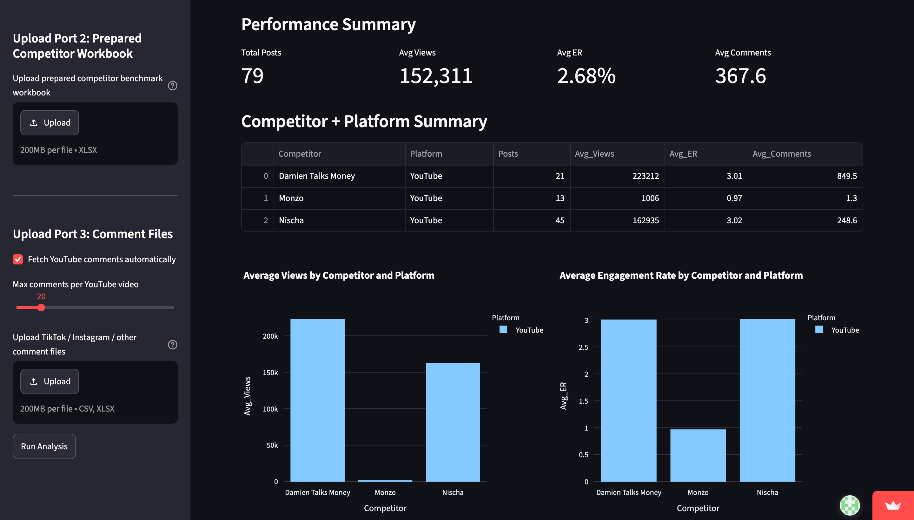
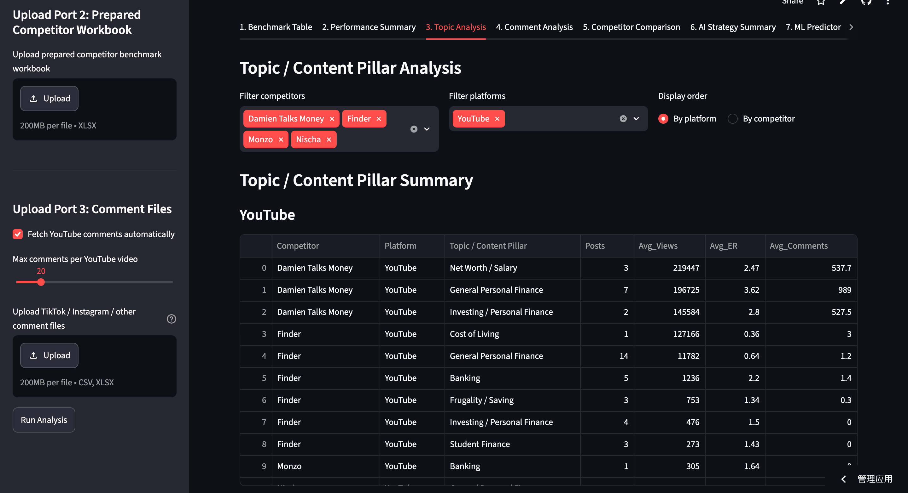
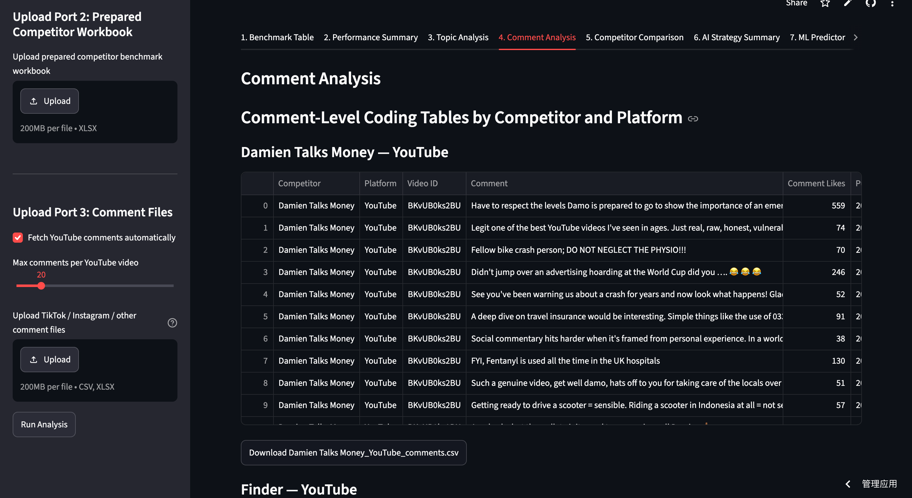
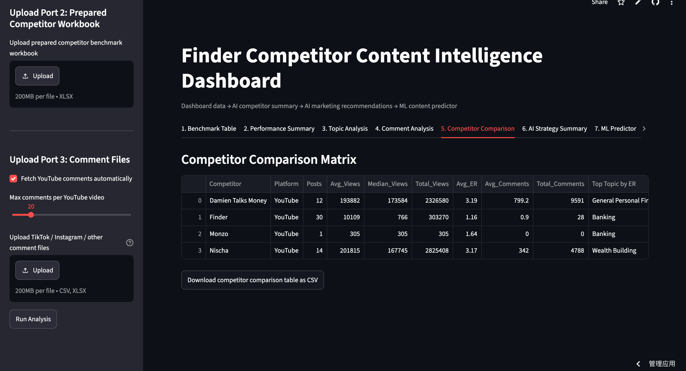
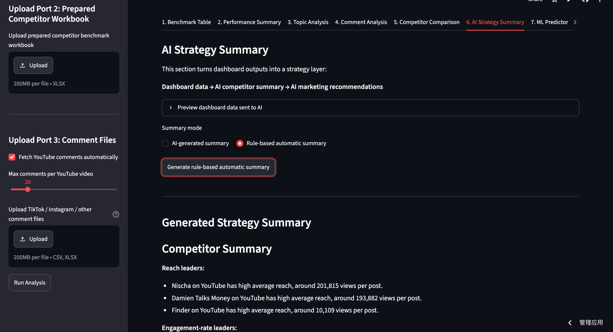
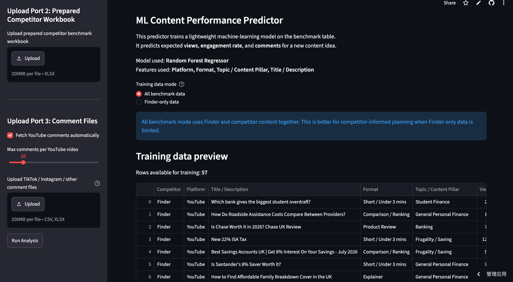

# Finder Competitor Content Intelligence Dashboard

An AI-powered competitor intelligence dashboard built with Python and Streamlit.

This project helps marketing and business teams collect competitor content, benchmark social media performance, analyse audience engagement, generate strategy recommendations, and predict future content performance through machine learning.

---

## Live Demo

Streamlit App:
https://finder-competitor-dashboard-bxd9dc9zv3sqkv9rzskiwc.streamlit.app/

---

## Project Overview

This dashboard provides an end-to-end workflow for competitor intelligence.

Instead of analysing individual posts manually, users can automatically collect YouTube data, standardise benchmarking metrics, compare competitors, analyse audience comments, generate marketing recommendations, and train predictive models for future content performance.

The system was originally developed for Finder's marketing competitor benchmarking project and has been extended into a reusable analytics platform.

---

## Core Workflow

YouTube API

↓

Competitor Data Collection

↓

Benchmark Dashboard

↓

Performance Analytics

↓

Topic & Content Analysis

↓

Comment Analysis

↓

Competitor Comparison

↓

Strategy Recommendation Engine

↓

Machine Learning Prediction

---

## Features

### 1. Benchmark Table

- Collect competitor content through YouTube API
- Standardise benchmark tables
- Support multiple competitors
- Export benchmark data as CSV

---

### 2. Performance Summary

Generate dashboard KPIs including

- Total Posts
- Average Views
- Engagement Rate
- Average Comments

Visualisations include

- Competitor comparison
- Platform comparison
- Performance charts

---

### 3. Topic / Content Analysis

Automatically group content into marketing topics.

Examples include

- Banking
- Investing
- Personal Finance
- Student Finance
- Cost of Living
- Saving

Supports

- Competitor filters
- Platform filters
- Flexible sorting

---

### 4. Comment Analysis

Analyse audience comments collected directly from YouTube.

Includes

- Comment-level dataset
- Comment engagement
- CSV export
- Audience discussion analysis

---

### 5. Competitor Comparison

Compare competitors across multiple dimensions

- Views
- Engagement Rate
- Comments
- Topic performance
- Overall benchmark metrics

---

### 6. AI Strategy Summary

Automatically converts dashboard outputs into actionable business insights.

Current implementation includes

- Rule-based strategy generation
- Competitor summary
- Marketing recommendations

The system is designed to support optional LLM integration in future versions.

---

### 7. ML Content Performance Predictor

Train a machine learning model to estimate future content performance.

Current model

- Random Forest Regressor

Prediction targets

- Expected Views
- Engagement Rate
- Expected Comments

Supported features

- Platform
- Topic
- Content Format
- Title
- Description

---

## Dashboard Preview

### Homepage



---

### Performance Summary



---

### Topic Analysis



---

### Comment Analysis



---

### Competitor Comparison



---

### AI Strategy Summary



---

### ML Predictor



---

## Tech Stack

Python

Streamlit

Pandas

NumPy

Plotly

Scikit-learn

YouTube Data API v3

OpenPyXL

---

## Project Structure

```
Finder-Competitor-Dashboard
│
├── app.py
├── requirements.txt
├── README.md
├── screenshots/
│   ├── homepage.png
│   ├── performance.png
│   ├── topic.png
│   ├── comment.png
│   ├── comparison.png
│   ├── ai_summary.png
│   └── ml_predictor.png
```

---

## Installation

Clone the repository

```bash
git clone https://github.com/yourusername/Finder-Competitor-Dashboard.git
```

Install dependencies

```bash
pip install -r requirements.txt
```

Run locally

```bash
streamlit run app.py
```

---

## Future Improvements

- OpenAI-powered strategy generation
- Multi-platform support (TikTok / Instagram / LinkedIn)
- Interactive dashboard filtering
- Competitor trend forecasting
- Sentiment analysis using LLMs
- Automated report generation

---

## Author

Jiayi Hu

MSc Marketing Science

Project focus

Marketing Analytics • Machine Learning • Business Intelligence • AI Applications
